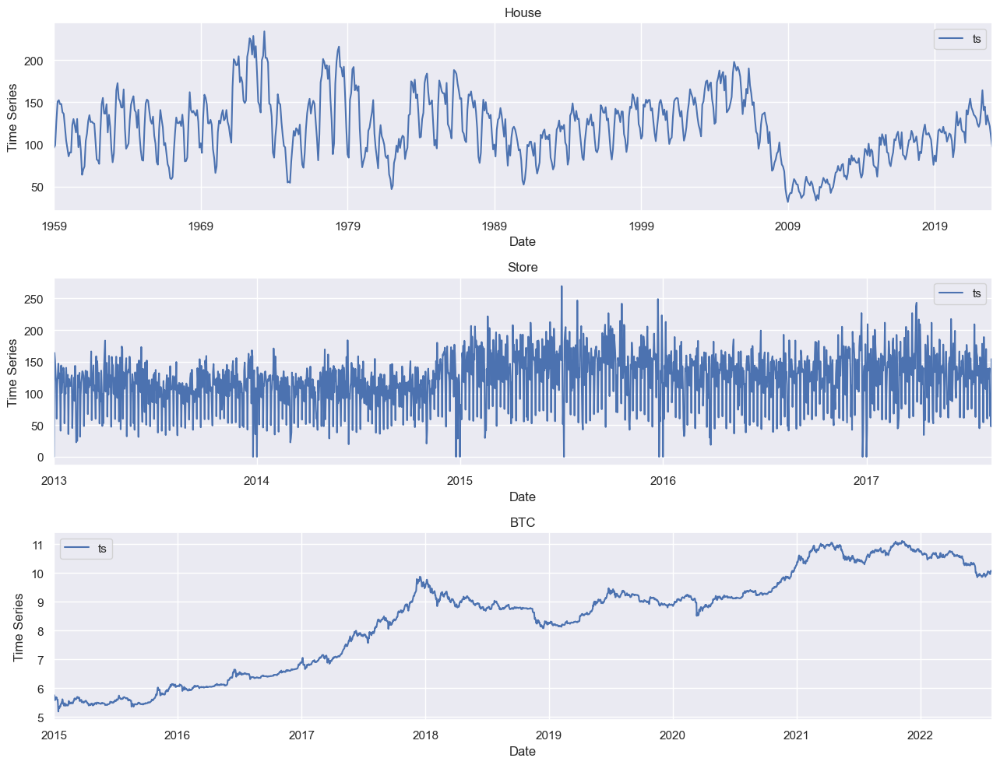

# **Time series forecasting**
**A simple tutorial**

Time series forecasting is a method used to predict future values based on historical data. It is a crucial tool for businesses, governments, and researchers to plan and make informed decisions. Time series forecasting can be used in various applications, including weather forecasting, financial forecasting, and demand forecasting. It enables organizations to identify trends and patterns, estimate future demand, and plan for future events.

There are several methods for time series forecasting, including statistical methods, machine learning algorithms, and artificial neural networks. Statistical methods, such as exponential smoothing and ARIMA, are widely used to forecast time series data. These methods rely on historical data and mathematical models to predict future values. On the other hand, machine learning algorithms, such as decision trees and random forests, can be used to analyze complex patterns and relationships in the data. These algorithms can handle large volumes of data and can automatically learn and adapt to changing patterns.

Forecasting using machine learning is gaining popularity due to its ability to handle complex and large datasets. Machine learning algorithms, such as neural networks, deep learning, and support vector machines, can identify complex patterns and relationships in the data that are difficult to detect using traditional statistical methods. Machine learning models can analyze multiple factors simultaneously and can handle large datasets with high dimensionality. Moreover, these models can be trained to adapt to changing patterns and make accurate predictions even when faced with noisy and incomplete data.

In this project, we analyze three time series and then, develop different forecasting models for each one. These datasets are:  

**Dataset 1:** The monthly data of 'New Privately-Owned Housing Units Started: Total Units' available [here](https://fred.stlouisfed.org/series/HOUSTNSA).  
**Dataset 2:** The daily data of `DELI` sales for store number 1 from the 'Store Sales - Time Series Forecasting' on Kaggle website available [here](https://www.kaggle.com/competitions/store-sales-time-series-forecasting/code?competitionId=29781&sortBy=voteCount)  
**Dataset 3:** The daily data of the logarithem of the Bitcoin 'Close' price extracted from the 'Yahoo Finance' repository.

The following figure shows the line graphs of the time series.

The time series are first analuzed in `data_analysis.ipynb`. One-step ahead forecasting models are developed in `forecasting_1stepAhead.ipynb`. 

The sections of `data_analysis.ipynb` are:  

1. Quick Look at Data  
---- 1.1. Datasets  
---- 1.2. Visualizing data  
---- 1.3. Checking some statistics  
---- 1.4. Train-Test splitting  
2. More Visualizations  
---- 2.1. Seasonal Plots  
---- 2.2. Seasonal Subseries Plots  
---- 2.3. Periodogram  
---- 2.4. Lag Plots  
---- 2.5. Autocorrelation Plots   
3. Time Series Decomposition  
4. Classical Decomposition  
5. STL Decomposition  
---- 5.1. Time Series Decomposition  
---- 5.2. Trend and Seasonality Strengths  

The sections of `forecasting_1stepAhead.ipynb` are:  

0. Importing Datasets  
 Defining Some Functions  
1. Benchmark Models  
2. Linear Regression Method  
3. Hybrid Forecasting with Residuals  
4. ARIMAX Method  
5. Recurrent Neural Networks (RNN)  
6. Long Short-Term Memory (LSTM) Networks  
----- 6.1. Vanilla LSTM  
----- 6.2. Stacked LSTM  
----- 6.3. Bidirectional LSTM  
7. Gated Recurrent Unit (GRU)  

